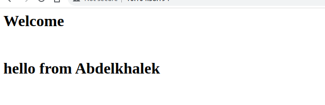

# Helm-deploy-custom-nginx
Deploying nginx on kubernetes cluster with custom index.html page and sending traffic to loadbalancer, using helm to install kubernetes objects.<br>
NameSpace: webapp

### Requirments :
- Kubectl cli
- MiniKube

### Run these commands while you are in Helm-deploy-custom-nginx directory:
```
helm install custom-nginx webapp/ --namespace webapp
```

### To make sure everything is running :
```
kubectl get all --namespace webapp
```
### Start minikube tunnel:
```
minikube tunnel
```
**now you can insert ip of the loadbalancer in your browser and the python app will be up and running.**\


### Note:
You can customize index.html from this file : **(Helm-deploy-custom-nginx/webapp/templates/configmap.yaml)**